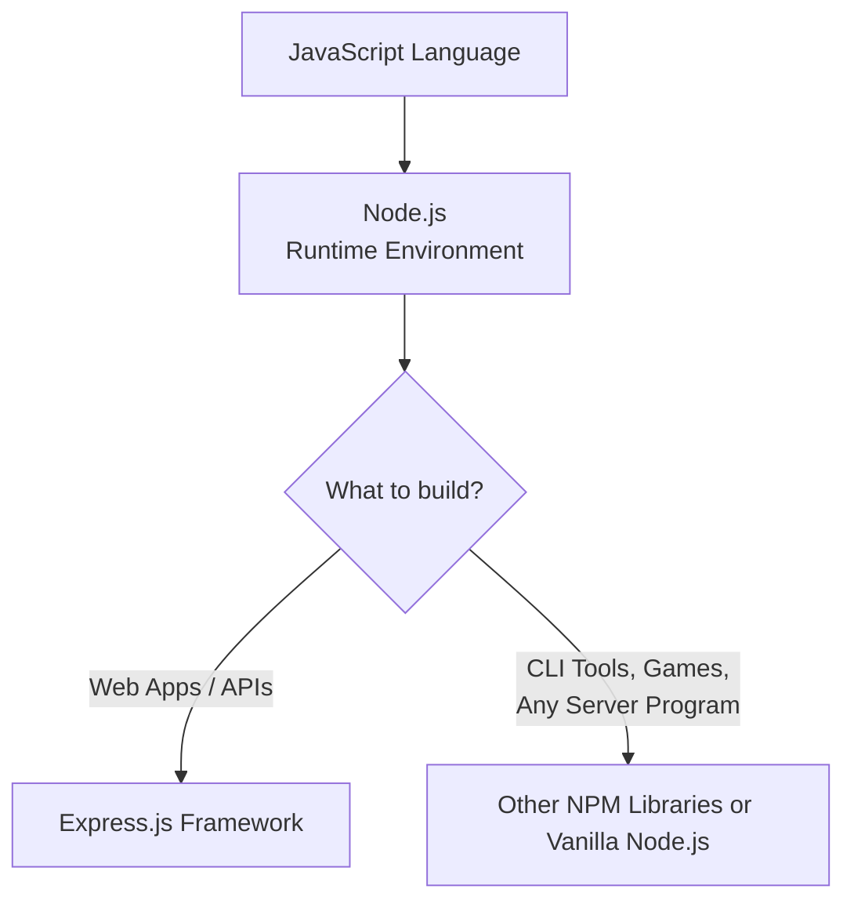
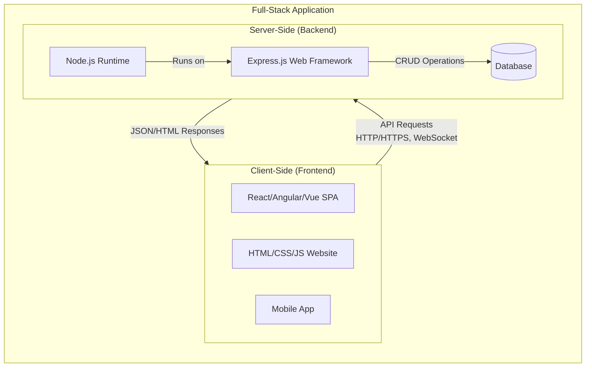

This is a very common and important question! **Node.js** and **Express.js** are fundamentally different technologies that work together, not alternatives. Here’s the core distinction:

Think of **Node.js as the engine** of a car. It's the JavaScript runtime environment that lets you run JavaScript code on a server, outside of a browser.

Think of **Express.js as a specific chassis and body kit** you can bolt onto that engine to easily build a specific type of vehicle (a web application or API).

Here is a detailed comparison:

| Feature | **Node.js** | **Express.js** |
| :--- | :--- | :--- |
| **Core Identity** | A **JavaScript runtime environment** (built on Chrome's V8 engine). | A **web application framework** built for Node.js. |
| **Primary Purpose** | Executes JavaScript on the server. Provides the basic building blocks for any server-side program (file system access, HTTP modules, etc.). | **Specifically** for building web applications and APIs. It provides structure and helpful utilities for this task. |
| **Analogy** | The **engine, wheels, and chassis** that make a vehicle possible. | A pre-built **car body kit** designed to easily turn that chassis into a functional car. |
| **HTTP Server** | You can create one from scratch using the built-in `http` module, but it requires more code. | **Dramatically simplifies** creating servers and handling routes with minimal, clean syntax. |
| **Level** | **Lower-level platform**. You have to manually handle more details. | **Higher-level framework**. It abstracts away common, repetitive tasks. |
| **Dependency** | It is a standalone **platform**. | It is a **dependency/library (npm package)** that runs on top of Node.js. |

### ⚙️ A Practical Code Example

Let's see how you create a simple server that responds with "Hello World" using both:

**1. Using only Node.js (http module):**
```javascript
const http = require('http');

const server = http.createServer((req, res) => {
    // You must manually check the URL and method
    if (req.url === '/' && req.method === 'GET') {
        res.writeHead(200, { 'Content-Type': 'text/plain' });
        res.end('Hello World from Node.js!');
    } else {
        res.writeHead(404);
        res.end('Not Found');
    }
});

server.listen(3000, () => {
    console.log('Server running on port 3000');
});
```

**2. Using Node.js + Express.js:**
```javascript
const express = require('express');
const app = express();

app.get('/', (req, res) => {
    // Express handles the headers and status code automatically
    res.send('Hello World from Express!');
});

app.listen(3000, () => {
    console.log('Server running on port 3000');
});
```

### 📦 What Does Express.js Add?

As the example shows, Express builds on top of Node.js to provide:
*   **Routing**: Clean syntax for defining application endpoints (`app.get`, `app.post`, `app.put`, `app.delete`).
*   **Middleware**: A powerful concept for functions that have access to the request/response objects, allowing you to execute code, modify data, end the cycle, or call the next function.
*   **Simplified Request/Response Handling**: Helper methods like `res.send()`, `res.json()`, and `res.render()`.
*   **Ecosystem**: A vast collection of compatible middleware packages (for authentication, parsing, sessions, etc.).

### 🔗 The Relationship in a Nutshell

You **cannot** use Express.js without Node.js. You **can** build a web server with just Node.js, but Express makes it much faster, easier, and more maintainable.

For a visual summary:



In full-stack development, **Node.js** and **Express.js** work together as the powerful backend engine, communicating with the frontend.

Here's a visual overview of their roles in the full-stack architecture:



### 💻 How Node.js & Express.js Power the Backend

Here’s how they work together in code for a typical REST API backend:

**Backend Server Setup (Node.js + Express.js):**
```javascript
// server.js - Backend using Node.js runtime with Express framework
const express = require('express');
const app = express();
const PORT = process.env.PORT || 5000;

// Middleware (Express feature)
app.use(express.json()); // Parse JSON request bodies

// Database connection (Using Node.js capabilities)
const mongoose = require('mongoose');
mongoose.connect('mongodb://localhost:27017/mydb', { 
  useNewUrlParser: true, 
  useUnifiedTopology: true 
});

// Define data model
const Todo = mongoose.model('Todo', {
  title: String,
  completed: Boolean
});

// API Routes (Express feature)
app.get('/api/todos', async (req, res) => {
  try {
    const todos = await Todo.find(); // Database operation
    res.json(todos); // Send JSON response
  } catch (error) {
    res.status(500).json({ error: error.message });
  }
});

app.post('/api/todos', async (req, res) => {
  try {
    const newTodo = new Todo(req.body);
    await newTodo.save();
    res.status(201).json(newTodo);
  } catch (error) {
    res.status(400).json({ error: error.message });
  }
});

// Start server (Node.js http server underneath)
app.listen(PORT, () => {
  console.log(`Backend server running on port ${PORT}`);
});
```

### 🌐 How the Frontend Connects

**Frontend JavaScript (React example):**
```javascript
// Frontend component that talks to the backend
import React, { useState, useEffect } from 'react';

function TodoApp() {
  const [todos, setTodos] = useState([]);
  const [newTodo, setNewTodo] = useState('');

  // GET request to fetch data from Express backend
  useEffect(() => {
    fetch('http://localhost:5000/api/todos')
      .then(response => response.json())
      .then(data => setTodos(data));
  }, []);

  // POST request to send data to Express backend
  const handleSubmit = async (e) => {
    e.preventDefault();
    const response = await fetch('http://localhost:5000/api/todos', {
      method: 'POST',
      headers: { 'Content-Type': 'application/json' },
      body: JSON.stringify({ 
        title: newTodo, 
        completed: false 
      })
    });
    const data = await response.json();
    setTodos([...todos, data]);
    setNewTodo('');
  };

  return (
    <div>
      <h1>My Todos</h1>
      <form onSubmit={handleSubmit}>
        <input 
          value={newTodo}
          onChange={(e) => setNewTodo(e.target.value)}
          placeholder="Add new todo"
        />
        <button type="submit">Add</button>
      </form>
      <ul>
        {todos.map(todo => (
          <li key={todo._id}>{todo.title}</li>
        ))}
      </ul>
    </div>
  );
}
```

### 🛠️ Real-World Division of Labor

Here's how the work is typically divided:

| **Task** | **Node.js Role** | **Express.js Role** | **Frontend Role** |
|----------|------------------|---------------------|-------------------|
| **Server Operation** | Provides the runtime environment | Creates the server application | N/A |
| **Routing** | Manual with `http` module | Clean syntax: `app.get('/path', handler)` | Makes requests to these routes |
| **Request Processing** | Raw request/response objects | Middleware pipeline, body parsing | Sends structured requests |
| **Database Operations** | File system, database drivers | Route handlers organize the logic | Displays the fetched data |
| **Static Files** | Can serve with manual coding | `express.static()` middleware | Requests CSS/JS/image files |
| **Error Handling** | Try-catch, callbacks | Centralized error middleware | Displays user-friendly errors |
| **Real-time Features** | WebSocket support via `ws` library | Socket.io integration on top | Connects to WebSocket |

### 📁 Project Structure Example

A typical full-stack project looks like this:

```
my-fullstack-app/
├── client/                    # Frontend
│   ├── public/
│   ├── src/
│   │   ├── components/
│   │   ├── App.js
│   │   └── index.js
│   └── package.json
├── server/                    # Backend (Node.js + Express)
│   ├── models/               # Database models
│   ├── routes/               # Express route definitions
│   ├── middleware/           # Custom Express middleware
│   ├── server.js            # Main Express app
│   └── package.json
├── package.json              # Root package (optional)
└── README.md
```

### 🔧 Key Integration Points

1. **API Communication**: Frontend uses `fetch()` or `axios` to call Express routes
2. **CORS Configuration**: Express needs middleware to accept requests from frontend:
   ```javascript
   const cors = require('cors');
   app.use(cors({ origin: 'http://localhost:3000' })); // React dev server
   ```
3. **Environment Variables**: Both sides need configuration:
   ```javascript
   // Backend .env
   DB_URL=mongodb://localhost:27017/mydb
   JWT_SECRET=your_secret_key
   
   // Frontend .env
   REACT_APP_API_URL=http://localhost:5000/api
   ```
4. **Authentication**: Express handles login, issues tokens; frontend stores and sends them:
   ```javascript
   // Express auth middleware
   app.use('/api', authenticateToken);
   
   // Frontend request with token
   fetch('/api/protected', {
     headers: { 'Authorization': `Bearer ${token}` }
   });
   ```

### 🚀 Development Workflow

1. **Backend First**: Build Express API endpoints with Node.js
2. **Test with Tools**: Use Postman or curl to test endpoints
3. **Frontend Integration**: Connect frontend to these endpoints
4. **Deployment**: Deploy backend to services like Heroku, AWS, or DigitalOcean; frontend to Netlify, Vercel, or S3

### 💡 Best Practices

- **Keep API consistent**: Use RESTful conventions in Express routes
- **Validate data**: Use Express middleware like `express-validator`
- **Handle errors gracefully**: Both in Express and frontend
- **Use environment variables**: Different configs for development/production
- **Implement security**: Helmet.js for Express, sanitize inputs

Would you like to see a specific example like user authentication flow or real-time chat implementation using this stack?


